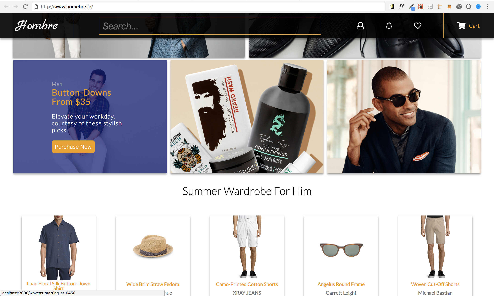

#### API HAS BEEN DISCONTINUED...
Unfortunately, Gilt Groupe, the fashion retailer 
behind this API, has currenty decided to end their service 
at this time until further notice. 
Thus, the Live version of this website will not work however, 
you can see screenshots and more info via the Github page.

## HOMBRE - Men's Fashion Ecommerce Store (Front End)

[LIVE DEMO](http://5af4684bc965925d86b1a8b6.priceless-yonath-8661da.netlify.com/)

#### Concept 

I wanted to explore building out an fashion retailer ecommerce site. At first it seemed that task was a bit daunting as there was almost too much data, but I specifically decided to focus on menswear. I got decent data and photos using the [Gilt Groupe](https://ww.gilt.com) API and had to manipulate the response data in order to get what I needed. 

#### Building

I started off with the individual components (ui, cards, etc) and then integrated the API reponse data by passing down props to each of the components when necessary for them to render. Overall it was a fun and interesting project to get to know more in depth about the React library.

#### Issues
There were a few React bugs that I had fixed however, I am still trying to resolve the issue of the scrollbar position when the user gets routed to a new page. I will also have to reimplement the search functionality as well.
